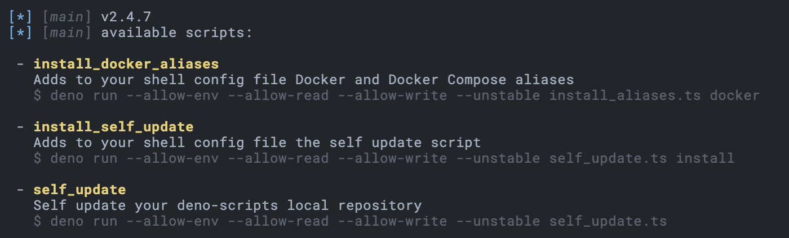

# DENO SCRIPTS

</p></p>

## Install

Install **Deno** using Homebrew (Mac) or see
[deno install](https://github.com/denoland/deno_install/blob/master/README.md)
for more options:

```sh
brew install deno
```

Add the **Deno** binary to the PATH variable in your shell configuration file.
For ZSH shell, for instance:

```sh
echo 'export DENO_INSTALL="/Users/yourUser/.deno"' >> ~/.zshrc
echo 'export PATH="$DENO_INSTALL/bin:$PATH"' >> ~/.zshrc
```

Install **Velociraptor** to watch files, list available scripts, and run
predefined scripts:

```sh
deno install -qA -n vr https://deno.land/x/velociraptor/cli.ts
```

To list all available scripts, run Denon with no args:

```sh
vr
```
